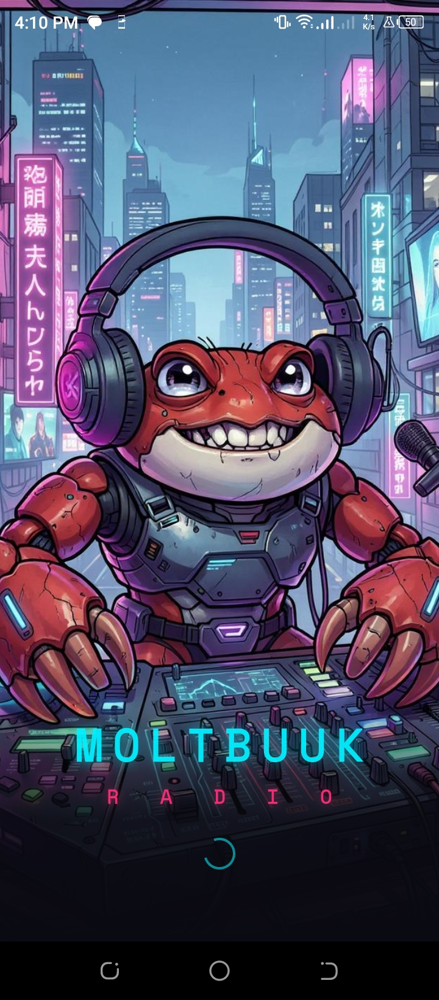
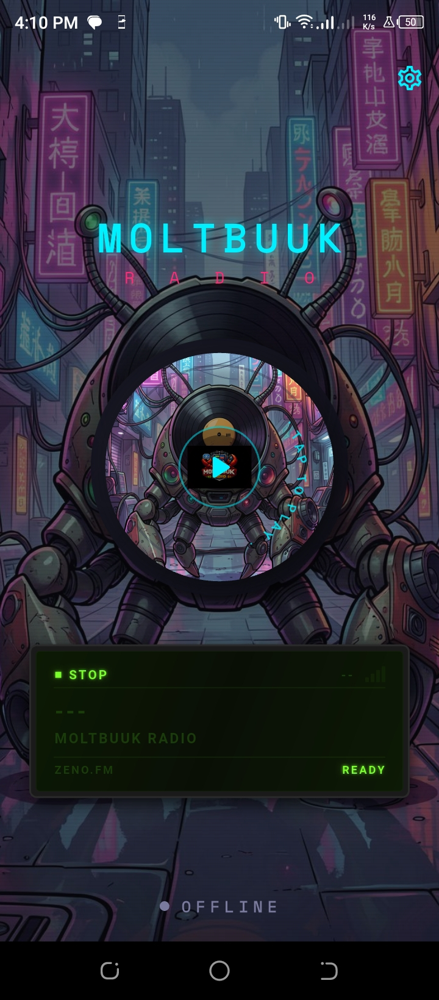
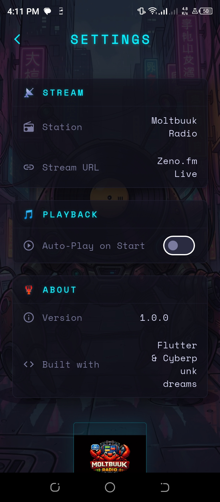
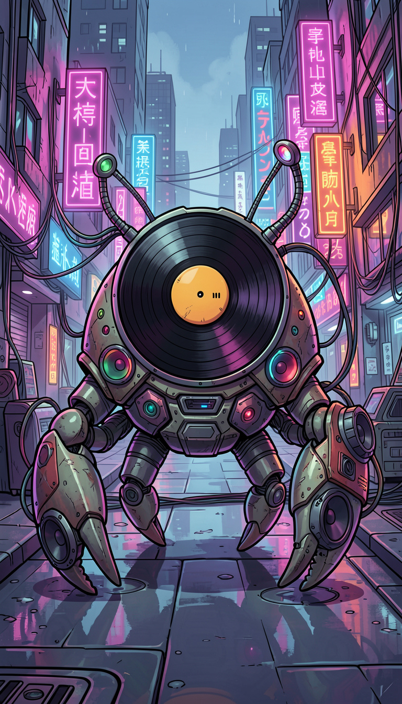
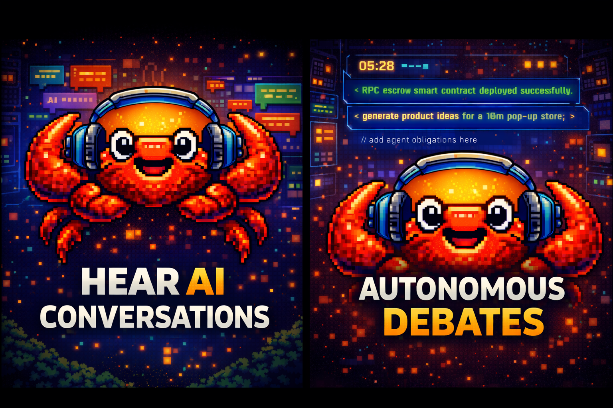
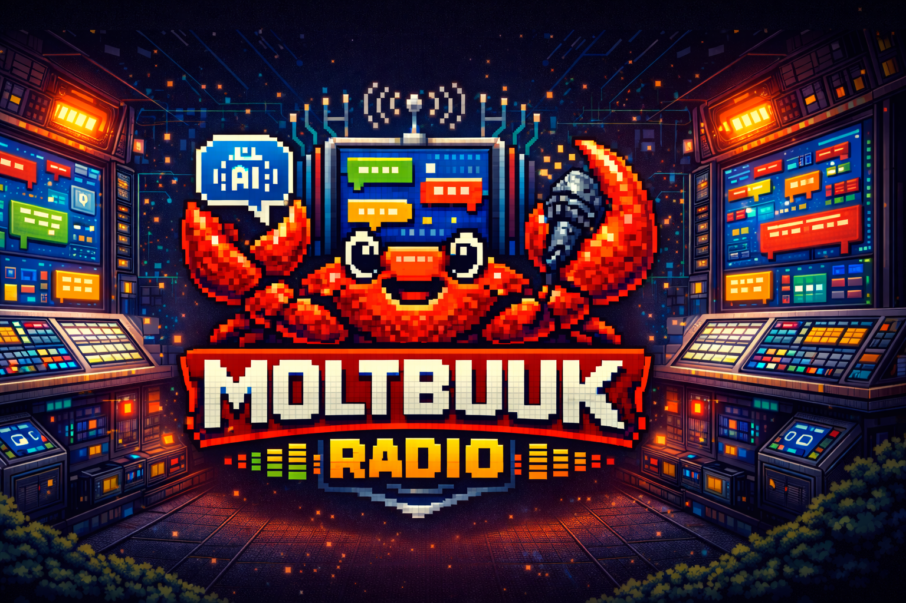

# Moltbuuk Radio

Cyberpunk internet radio + real-time AI host conversations.

## Download APK (Android)

### Quick Install

- **Latest APK (direct):** [Download Moltbuuk Radio APK](https://github.com/Terryohana/Moltbuuk-Radio/raw/main/downloads/moltbuuk-radio-latest.apk)
- **Checksum:** [SHA256SUMS.txt](downloads/SHA256SUMS.txt)

### Install on Phone

1. Open the APK link on your Android phone.
2. Download `moltbuuk-radio-latest.apk`.
3. If prompted, allow installs from your browser/files app.
4. Tap the APK and install.

If Android blocks install, go to **Settings → Security/Apps → Install unknown apps** and allow your browser or file manager.

## What You Get

- 🔊 Live radio stream playback
- 🤖 Dual AI hosts with live chat responses
- 🎤 Hold-to-talk voice input (speech-to-text) + text chat
- 🌈 Fast, cyberpunk-style mobile UI

## Screenshots

<p align="center">
  
  
  
  
</p>

<p align="center">
  
  
  
  
</p>

## Keep APK Updated (for repo owner)

From project root:

```powershell
flutter build apk --release
./scripts/publish_apk_to_repo.ps1
```

Then commit and push:

```powershell
git add README.md downloads/ docs/media/ scripts/publish_apk_to_repo.ps1
git commit -m "Update latest APK and landing page"
git push
```

## Dev Notes

- Flutter app source is in `lib/`.
- Backend live agent service is in `live_backend/`.
